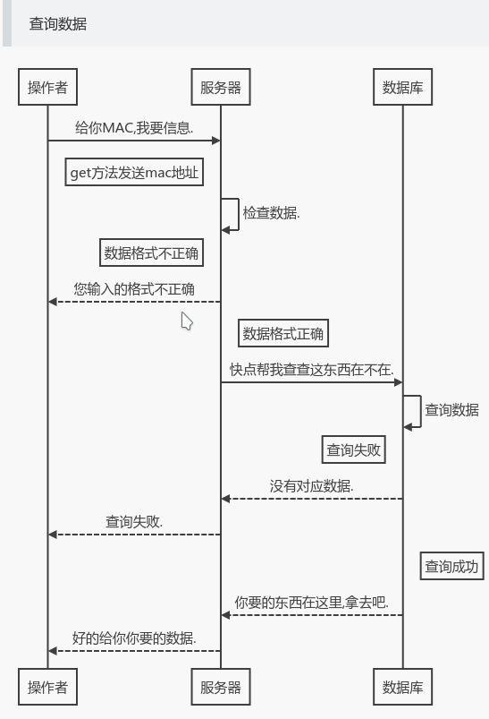
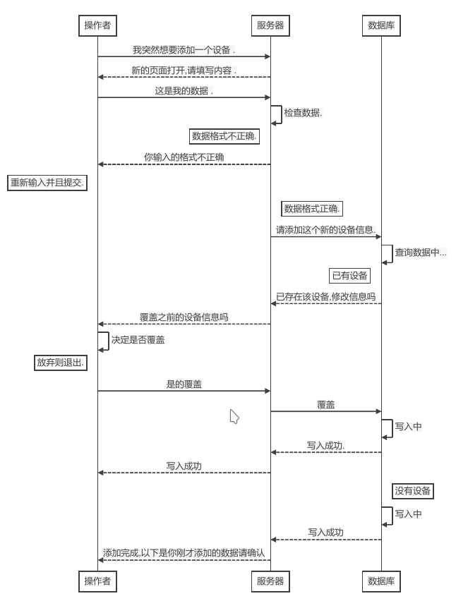
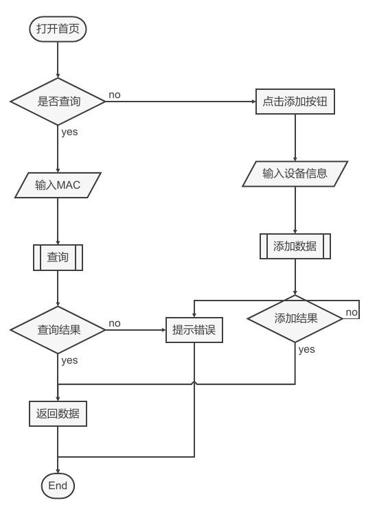

# devmp(Device management platform)
> 设备管理平台

- 用于管理公司办公电脑
- 查询办公电脑相关信息
- 年综汇总数据导出编辑
- 学习如何使用sqlite3数据库
- 导出所有设备信息并且将每个设备信息转换成二维码方便以后贴在设备上

为什么把网页模板拆分的那么零散的原因就是想看看模板嵌套的方法,以及如何向子模板里面传递数据.

开始编写日期: 2018年10月14日
